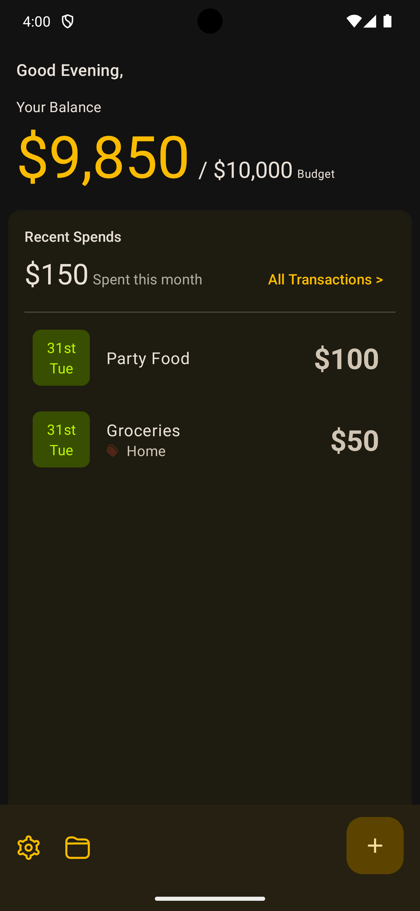

 

  <h3 align="center">Rivo</h3>

  

    An Android app to help track and manage your expenses
     
     
    <a href="https://github.com/RemijiusBrian/Rivo/issues">Report Bug</a>
    .
    <a href="https://github.com/RemijiusBrian/Rivo/issues">Request Feature</a>
  

## About The Project

Rivo is a user-friendly Android application designed to empower individuals in managing their finances effectively. With Rivo, users can effortlessly track and control their expenses, helping them maintain financial discipline and achieve their financial goals. This mobile app provides a comprehensive expense tracking and budget management solution, allowing users to take control of their financial well-being.

## Built With

Rivo uses Jetpack Compose for its UI and Kotlin as its programming language.
User data is stored locally within the app using the SQLite database and Room Persistence library.
Rivo also provides an online backup feature that leverages the Google Drive API to backup app data directly to the users Google Drive.

## Contributing

### Creating A Pull Request

1. Fork the Project
2. Create your Feature Branch (`git checkout -b feature/AmazingFeature`)
3. Commit your Changes (`git commit -m 'Add some AmazingFeature'`)
4. Push to the Branch (`git push origin feature/AmazingFeature`)
5. Open a Pull Request

## Authors

* **Remijius Brian** - *Android Developer* - [Remijius Brian](https://github.com/RemijiusBrian) - **
